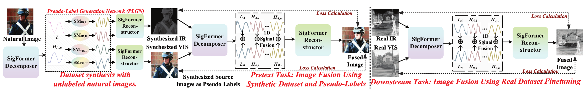
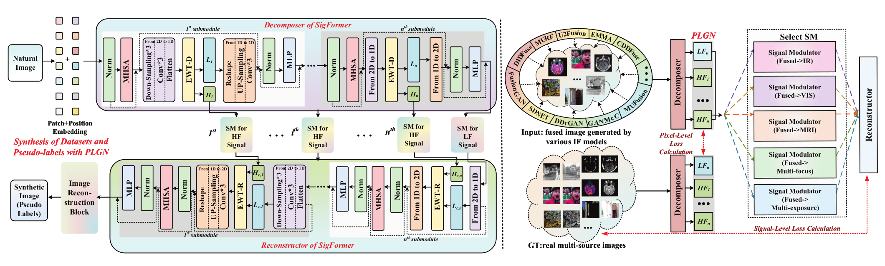
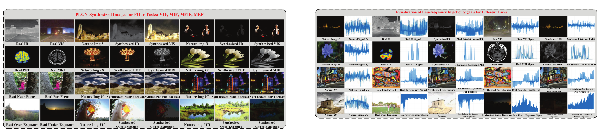
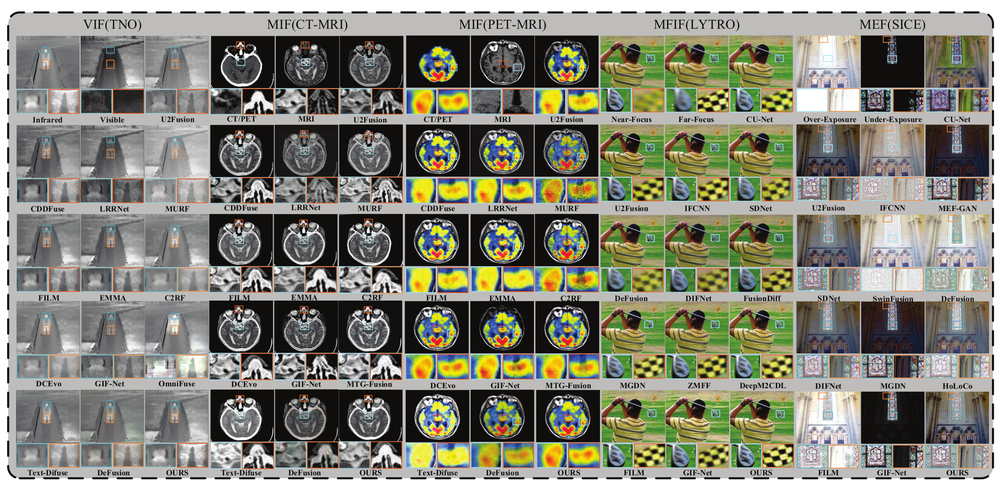
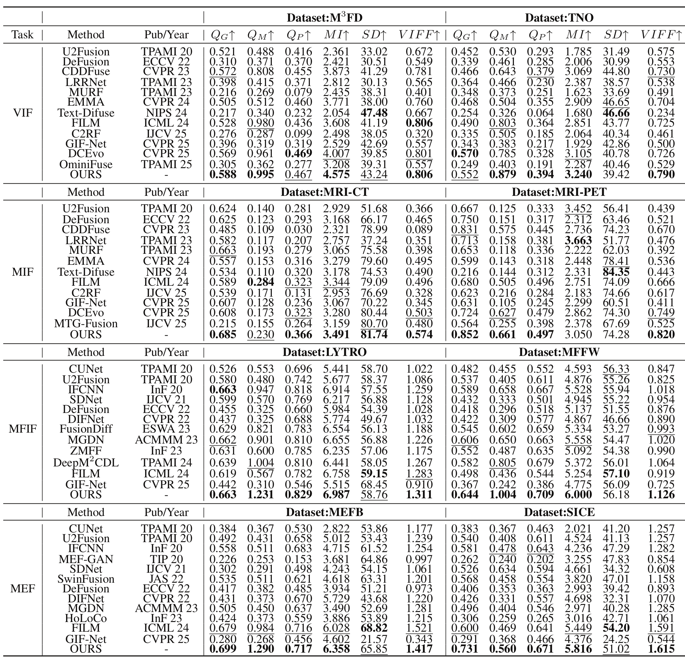

# SigFusion
Official implementation of our AAAI 2026 paper "SigFusion: Unified Signal-Level Self-Supervised Learning Paradigm for Image Fusion“

paper：[Our paper](https://ojs.aaai.org/index.php/AAAI/article/view/38009/41971)

The generated dataset：[Four tasks](https://drive.google.com/drive/folders/1CA5PR-Yig47_p3wUPgNTatNBOl-yq7kF?usp=drive_link)

## Highlights

- A unified signal-level self-supervised learning paradigm for infrared-visible, medical, multi-focus, and multi-exposure image fusion.
- A Pseudo-Label Generation Network (PLGN) that synthesizes realistic multi-source training pairs and pseudo-labels from unlabeled natural images.
- SigFormer combines adaptive signal decomposition and reconstruction with hierarchical Transformer learning.
- Signal Modulators transfer modality-specific frequency characteristics and reduce the gap between synthetic and real fusion data.

## Framework

<p align="center">
  
</p>

SigFusion follows a two-stage paradigm. The pretext stage uses PLGN to synthesize source-image pairs and pseudo-labels for large-scale pretraining; the downstream stage fine-tunes the pretrained SigFormer on real multi-source fusion data.

<details>
<summary><b>Detailed PLGN and SigFormer architecture</b></summary>

<p align="center">
  
</p>

</details>

## Synthetic Data and Signal Modulation

<p align="center">
  
</p>

PLGN learns signal characteristics from real multi-source images and injects them into natural images, producing training data for VIF, MIF, MFIF, and MEF within one framework.

## Qualitative Results

<p align="center">
  
</p>

Qualitative comparisons cover infrared-visible fusion, CT-MRI and PET-MRI medical fusion, multi-focus fusion, and multi-exposure fusion.

## Quantitative Results

<p align="center">
  
</p>


If this work is helpful to you, please cite it as:
```bibtex
@inproceedings{wang2026sigfusion,
  title={SigFusion: Unified Signal-Level Self-Supervised Learning Paradigm for Image Fusion},
  author={Wang, Zeyu and Feng, Jiawei and Wang, Jiayu and Wang, Pengjie and Song, Haiyu},
  booktitle={Proceedings of the AAAI Conference on Artificial Intelligence},
  volume={40},
  number={12},
  pages={10385--10393},
  year={2026}
}
```
